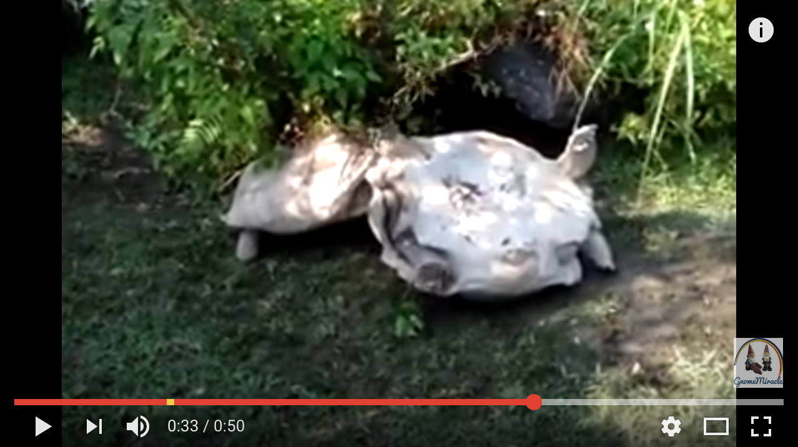

# Turtle Economics

Turtles are friendly creatures who may get into
difficult situations. The following demonstrates
how one turtle helped another turtle to aright: 

This is an analogy of a particular economic situation 
where one economy causes another failing economy to 
normalize. 

An example of Turtle Economics can be found in the 
[Arsenal of Democracy](https://en.wikipedia.org/wiki/Arsenal_of_Democracy).

 